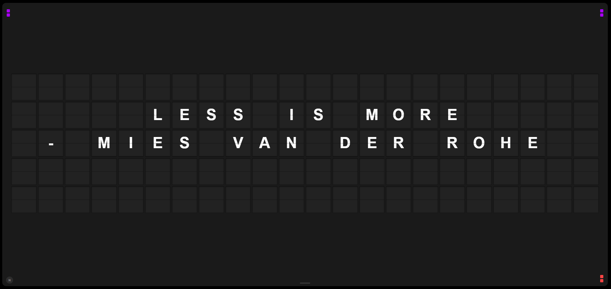

# Split-Flap Display

A retro airport-style split-flap display for TVs. We were asked to build one, so we did.

Turns any screen into a mechanical flip board with realistic animations, sound effects, and a backend to control it all from your phone or laptop.



## What It Does

- Realistic split-flap animations with GPU-accelerated CSS
- Mechanical flip sound effects recorded from actual hardware
- REST API + WebSocket server for real-time content control
- Web-based admin panel to manage messages, themes, and display config
- Multi-display support (run different boards on different TVs)
- Works on Smart TVs, Raspberry Pi, any browser

## Quick Start

```bash
cd server
npm install
npm start
```

Then open:

- **Display:** http://localhost:3000
- **Admin:** http://localhost:3000/admin

Press `F` for fullscreen. Press `M` to mute.

## API

All endpoints are under `/api`:

| Method | Endpoint                   | Description                 |
| ------ | -------------------------- | --------------------------- |
| GET    | `/api/messages`            | List all messages           |
| POST   | `/api/messages`            | Create a message            |
| PUT    | `/api/messages/:id`        | Update a message            |
| DELETE | `/api/messages/:id`        | Delete a message            |
| GET    | `/api/displays`            | List display configs        |
| POST   | `/api/displays`            | Create a display config     |
| PUT    | `/api/displays/:id/config` | Update display config       |
| POST   | `/api/displays/:id/show`   | Push a message to a display |
| GET    | `/api/analytics/:id`       | Display analytics           |
| GET    | `/health`                  | Server health check         |

## Multiple Displays

Open the display with a query param to target a specific board:

```
http://localhost:3000?display=lobby
http://localhost:3000?display=breakroom
```

Each display gets its own config and message queue. Manage them all from the admin panel.

## Project Structure

```
display/          Frontend (HTML/CSS/JS, no build step)
  js/             Board renderer, sound engine, WebSocket client
  css/            Animations and layout
server/           Backend (Express + Socket.IO + SQLite)
  api/            REST endpoints
  websocket/      Real-time communication
  db/             Database layer
```

## Configuration

All display settings are adjustable through the admin panel or API:

- Grid size (columns/rows)
- Flip speed and stagger timing
- Message rotation interval
- Color themes (Rainbow, Classic, Amber, Green, Blue, Red, Purple, Mono, Custom)
- Tile styles (Flat, Gloss, Emboss, Inset, Neon Glow)
- Sound on/off

Theme and style changes push live to all connected displays via WebSocket.

## Security Notes

This is designed to run on a local network. CORS is open and there's no authentication by design -- it's a display board, not a bank.

If you're exposing this to the internet, you should add auth and lock down CORS. The bones are there (Helmet, rate limiting, input validation with Joi).

## License

MIT
